# Отчет по лабораторной работе: Задача покрытия множеств в условиях неопределенности

## 1. Введение и Постановка Задачи

В рамках данной лабораторной работы рассматривается задача о покрытии множества (Set Covering Problem) в условиях неопределенности. Цель состоит в выборе такого подмножества доступных множеств, чтобы каждый базовый элемент общего множества был покрыт хотя бы один раз, при минимизации общих затрат.

Математическая формулировка номинальной задачи:
$$\min_x \sum_{j=1}^n c_j x_j$$

При ограничениях:
$$\sum_{j=1}^n a_{ij} x_j \ge 1, \quad \forall i \in \{1, \dots, m\}$$
$$x_j \in \{0, 1\}, \quad \forall j \in \{1, \dots, n\}$$

Где:
* **n** — количество доступных подмножеств (кандидатов на выбор).
* **m** — количество элементов, которые необходимо покрыть.
* **x_j** — бинарная переменная решения (равна 1, если множество j выбрано, и 0 в противном случае).
* **c_j** — стоимость выбора множества j.
* **a_ij** — фиксированный бинарный параметр (равен 1, если множество j покрывает элемент i, и 0 в противном случае).

Особенность работы заключается в том, что стоимости стоимостей выбора множеств доподлинно неизвестны. Для решения проблемы применяются два принципиально разных подхода: **Робастная оптимизация** и **Стохастическое программирование**.

---

## 2. Часть 1: Робастный подход (Robust Optimization)

### 2.1 Теоретическая база

В данной задаче неопределенность затрагивает стоимости. В модели Bertsimas–Sim неопределенные коэффициенты представляются как «номинал + ограниченное отклонение», а параметр бюджета $\Gamma$ управляет уровнем робастности. При бюджете равном 0 имеем номинальную задачу, при большом бюджете — более консервативную. Стоимость выбора множества задается как:
$$c_j = \bar{c}_j + \hat{c}_j \xi_j, \quad j=1,...,n$$
где $\bar{c}_j$ является номинальной стоимостью, $\hat{c}_j \ge 0$ — это максимальное отклонение, а значит $0 \le \xi_j \le 1$.

Бюджетно-ограниченное множество неопределенности задается так:
$$\mathcal{U}_{\Gamma} = \left\{ \xi \in \mathbb{R}^n: 0 \le \xi_j \le 1, \sum_{j=1}^{n} \xi_j \le \Gamma \right\}, \quad 0 \le \Gamma \le n$$

Смысл ограничения в том, что одновременно могут ухудшиться не более $\Gamma$ коэффициентов. Робастная (минимаксная) постановка задачи принимает вид:
$$\min_{x \in \{0,1\}^n} \left\{ \sum_{j=1}^{n} \bar{c}_j x_j + \max_{\xi \in \mathcal{U}_{\Gamma}} \sum_{j=1}^{n} \hat{c}_j x_j \xi_j \right\}$$
с учетом стандартных ограничений покрытия.

Через теорию двойственности внутренняя задача максимизации переформулируется, что позволяет свести общую проблему к **одноуровневой MILP-задаче** (Mixed-Integer Linear Programming):
$$\min_{x, \mu, \nu} \left[ \sum_{j=1}^{n} \bar{c}_j x_j + \Gamma \mu + \sum_{j=1}^{n} \nu_j \right]$$

При ограничениях:
$$\sum_{j=1}^n a_{ij} x_j \ge 1 \quad \forall i \in \{1,...,m\}$$
$$\mu + \nu_j \ge \hat{c}_j x_j \quad \forall j \in \{1,...,n\}$$
$$\mu \ge 0, \quad \nu_j \ge 0, \quad x_j \in \{0, 1\}$$

Для оценки качества решений применяются показатели In-sample performance ($\rho_{in}$) и Out-of-sample performance ($\rho_{out}$). Значение $\rho_{out}$ показывает реальную цену использования консервативного робастного решения на новых данных в сравнении с идеальным знанием будущих параметров.

### 2.2 Ожидания от экспериментов

* **Время решения**: Поскольку итоговая задача является MILP с небольшим числом дополнительных непрерывных переменных, ожидается, что современные солверы (например, Gurobi или CPLEX) будут решать ее крайне быстро (доли секунды для n до 50). Время будет возрастать с увеличением n.
* **Качество (OOS Ratio)**: Ожидается, что при правильно подобранном параметре $\Gamma$ мы получим решение, которое устойчиво к вариациям, но не переплачивает за излишнюю консервативность. In-sample оценка должна показывать переоценку затрат (значения > 1).

### 2.3 Результаты экспериментов

| Эксперимент                                              | n   | Время при фикс. $\Gamma$ (с) | Опт. $\Gamma$ (по OOS) | Min OOS Ratio | In-sample при опт. $\Gamma$ |
| -------------------------------------------------------- | --- | ---------------------------- | ---------------------- | ------------- | --------------------------- |
| **base_case** (m=10, d=0.3, $\Gamma_{true}$=0.6n)        | 5   | 0.0006                       | 2                      | 1.0286        | 1.1342                      |
|                                                          | 15  | 0.0014                       | 5                      | 1.1496        | 1.4024                      |
|                                                          | 30  | 0.0032                       | 4                      | 1.4715        | 1.4920                      |
|                                                          | 50  | 0.0062                       | 4                      | 1.9447        | 1.4144                      |
| **high_density** (m=10, d=0.7, $\Gamma_{true}$=0.6n)     | 5   | 0.0008                       | 1                      | 1.1009        | 1.1131                      |
|                                                          | 25  | 0.0025                       | 1                      | 2.3759        | 1.4731                      |
|                                                          | 50  | 0.0049                       | 3                      | 3.0943        | 2.8789                      |
| **high_uncertainty** (m=10, d=0.3, $\Gamma_{true}$=0.9n) | 5   | 0.0007                       | 2                      | 1.0340        | 0.9628                      |
|                                                          | 25  | 0.0041                       | 4                      | 1.2315        | 1.2083                      |
|                                                          | 50  | 0.0094                       | 7                      | 1.4865        | 1.0969                      |

*(Примечание: в таблицу включены ключевые срезы n для демонстрации трендов).*

**base_case** (m=10, d=0.3, Γ_true=0.6n)

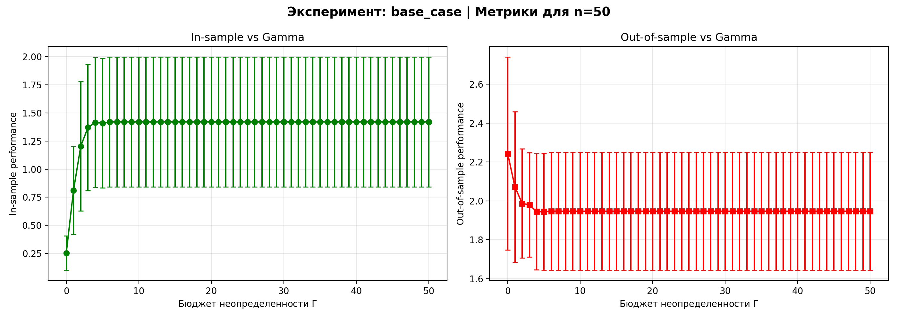
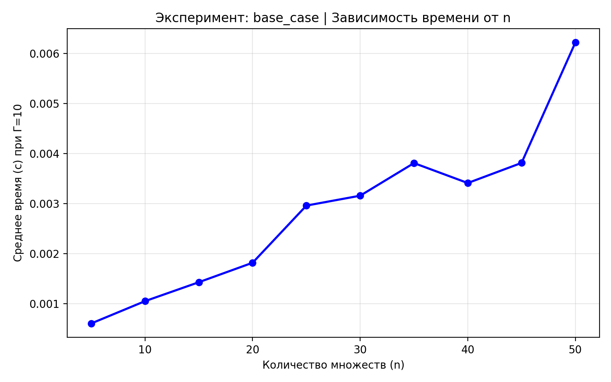

**high_density** (m=10, d=0.7, Γ_true=0.6n)

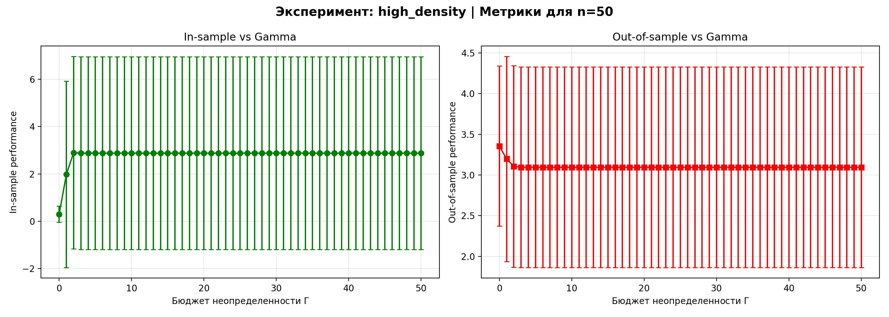
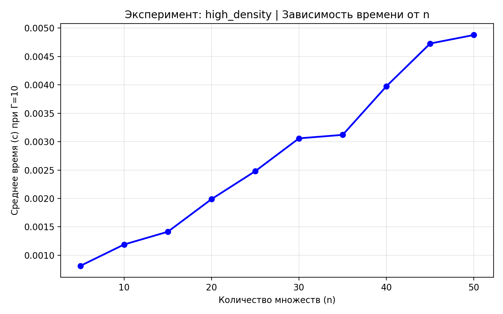

**high_uncertainty** (m=10, d=0.3, Γ_true=0.9n)

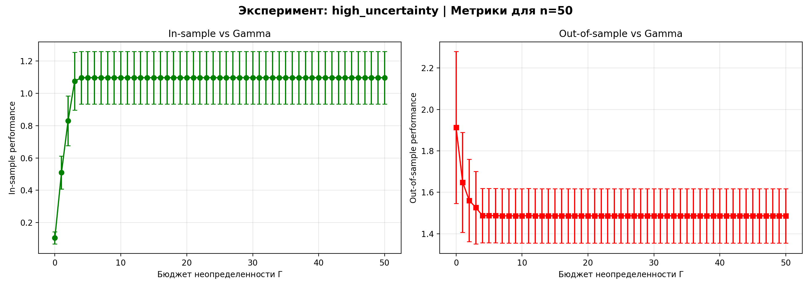
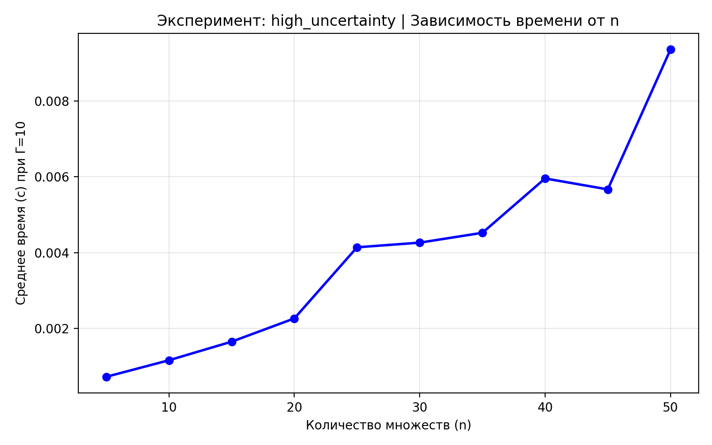

### 2.4 Анализ и выводы по робастному подходу

1. **Производительность**: Как и ожидалось, время вычислений крайне мало. Для максимального рассмотренного размера (n=50) время не превышает 0.01 секунды. Рост времени с увеличением n присутствует, но остается в рамках сотых долей секунды благодаря эффективности MILP-переформулировки.
2. **Оптимальный уровень консерватизма (Опт. $\Gamma$)**: Оптимальный бюджет неопределенности не является монотонной функцией от n, он адаптируется под специфику конкретного графа множеств. В базовом кейсе он варьируется от 2 до 5. В случае высокой истинной неопределенности (`high_uncertainty`) оптимальный бюджет закономерно выше (достигает 7 для n=50), что говорит о необходимости большей "перестраховки".
3. **Out-of-sample (OOS) Ratio**: Метрика показывает, во сколько раз мы переплачиваем на реальных данных по сравнению с идеальным оптимумом. С ростом размерности задачи эта переплата (Min OOS Ratio) растет. Особенно это выражено в сценарии `high_density`, где при n=50 мы переплачиваем более чем в 3 раза (3.0943). Это связано с тем, что высокая плотность покрытий дает много вариантов, и робастный подход выбирает слишком безопасный, но дорогой путь.
4. **In-sample оценка**: In-sample соотношение стабильно больше 1 (чаще около 1.1 — 1.4), что подтверждает консервативную природу робастной оптимизации: модель закладывает "буфер" на худший сценарий, ожидая бóльших затрат, чем происходит в среднем.

---

## 3. Часть 2: Стохастическое программирование

### 3.1 Теоретическая база

В стохастическом подходе предполагается, что стоимости $c_j$ обусловлены независимыми факторами и имеют нормальное распределение:
$$c_j \sim \mathcal{N}(\mu_j, \sigma_j^2), \quad j = 1, \ldots, n$$
усеченное снизу для неотрицательности.

Рассматриваются две стратегии:
* **Risk-neutral (RN) подход**: Минимизирует математическое ожидание затрат. Поскольку распределение заранее неизвестно, применяется SAA-аппроксимация (Sample Average Approximation) по k независимым реализациям (сценариям).
$$\min_{x \in X} \;\frac{1}{k} \sum_{s=1}^k \bigl(c^{(s)}\bigr)^\top x$$
* **Risk-averse (RA) подход**: Минимизирует риски реализации наихудших сценариев, используя метрику условной стоимости под риском — CVaR (Conditional Value at Risk) для уровня доверия $\alpha$.
$$\min_{x \in X} \;\mathrm{CVaR}_\alpha(c^\top x)$$
SAA-аппроксимация для Risk-averse подхода вводит дополнительные переменные $z_s$ для каждого из k сценариев:
$$\min_{\substack{x \in X,\; t \in \mathbb{R},\\ z_s \geq 0}} \;\left[ t + \frac{1}{(1-\alpha)k} \sum_{s=1}^k z_s \right]$$
при дополнительных ограничениях для сценариев:
$$z_s \geq \bigl(c^{(s)}\bigr)^\top x - t, \quad s = 1, \ldots, k$$

Для оценки модели исследуется ошибка несовпадения (Mismatch Error). Применение RN решения для оценки по критериям RA (и наоборот) показывает, какую цену (в виде OOS ошибки) заплатит лицо, принимающее решения, при неверном выборе целевой метрики.

### 3.2 Ожидания от экспериментов

* **Время решения**: SAA-аппроксимация RA подхода вводит k дополнительных переменных и ограничений (в экспериментах k=30). Ожидается, что RA будет решаться дольше, чем RN. По сравнению с робастным подходом стохастический может занимать больше времени из-за сценарного характера модели.
* **Mismatch Errors**: Ожидается сильное расхождение (высокий Mismatch и Bias) при высоких значениях $\alpha$ (например, 0.99), так как RA модель будет сфокусирована исключительно на хвосте распределения (экстремальных ситуациях), в то время как RN модель оптимзирует "среднее", игнорируя хвост.

### 3.3 Результаты экспериментов

| Эксперимент (Параметры)                   | n   | Время RN (с) | Время RA (с) | Mismatch CVaR  | Mismatch Mean | Bias RN | Bias RA |
| ----------------------------------------- | --- | ------------ | ------------ | -------------- | ------------- | ------- | ------- |
| **base_case** (m=20, d=0.2, $\alpha$=0.9) | 5   | 0.0054       | 0.0069       | 0.0000 ± 0.00  | 0.0000 ± 0.00 | 0.0207  | 1.3152  |
|                                           | 25  | 0.0123       | 0.0339       | 0.1108 ± 2.59  | 1.1696 ± 2.41 | 0.4755  | 2.8674  |
|                                           | 50  | 0.0215       | 0.0712       | 0.0340 ± 3.65  | 2.1774 ± 3.67 | 0.3945  | 3.7117  |
| **m_30** (m=30, d=0.2, $\alpha$=0.9)      | 25  | 0.0191       | 0.0570       | 0.0627 ± 2.31  | 0.9647 ± 2.44 | 0.5803  | 3.1321  |
|                                           | 50  | 0.0394       | 0.1501       | -0.4738 ± 3.79 | 1.8418 ± 3.18 | 0.5901  | 4.9076  |
| **alpha_0_6** ($\alpha$=0.6)              | 50  | 0.0233       | 0.0610       | -0.0382 ± 1.43 | 0.5014 ± 1.77 | 0.8416  | 1.5275  |
| **alpha_0_99** ($\alpha$=0.99)            | 50  | 0.0214       | 0.0686       | 0.2741 ± 4.26  | 2.0614 ± 3.79 | 0.5932  | 12.6314 |

*(Примечание: представлены агрегированные срезы из полной таблицы для наглядности).*

**base_case** (m=20, d=0.2, α=0.9)

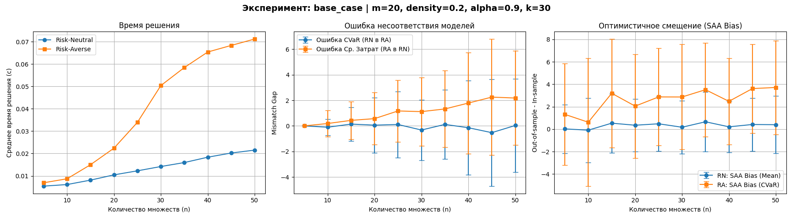

**m_10** (m=10)

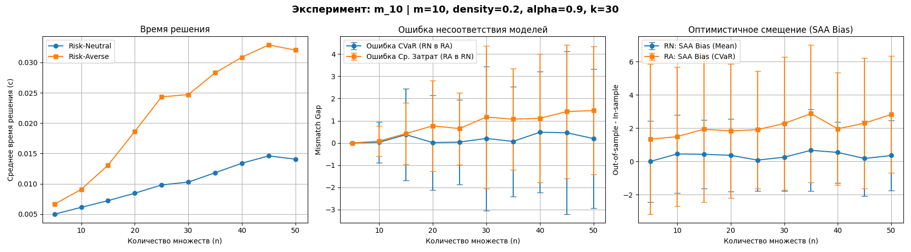

**m_30** (m=30, d=0.2, α=0.9)

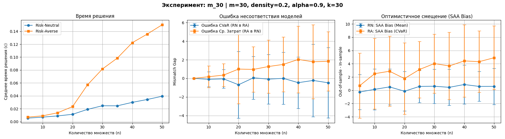

**alpha_0_6** (α=0.6)

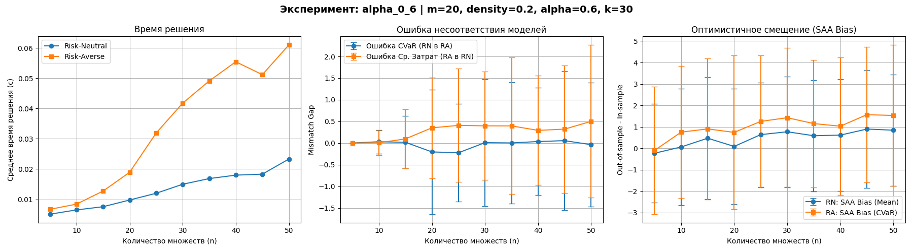

**alpha_0_95** (α=0.95)

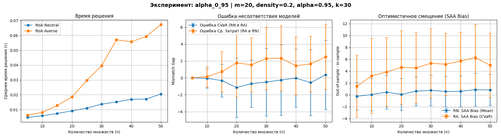

**alpha_0_99** (α=0.99)

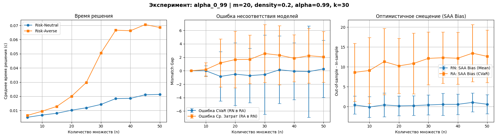

**density_0_1** (d=0.1)

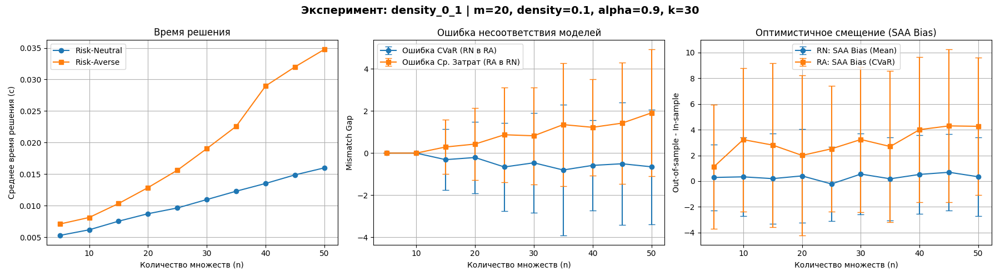

**density_0_7** (d=0.7)

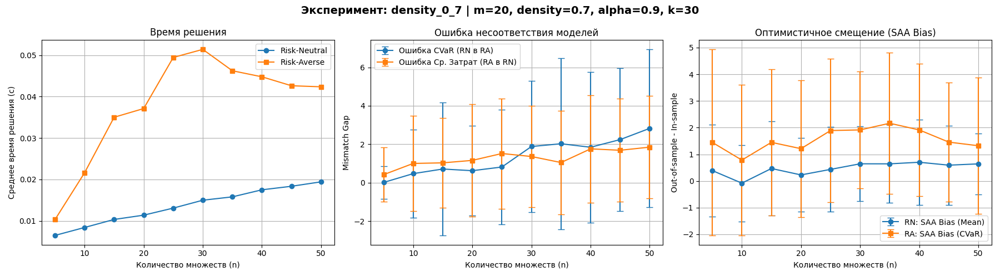

**hardcore_risk**

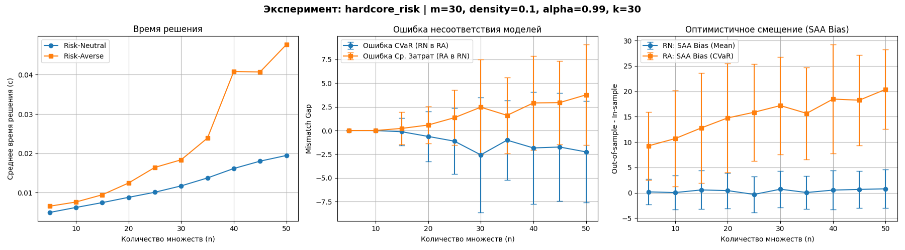

**trivial_case**

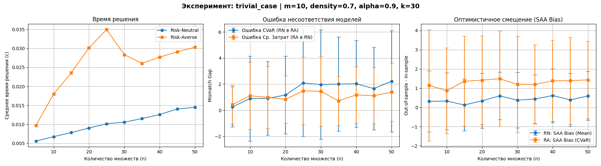

### 3.4 Анализ и выводы по стохастическому подходу

1. **Время решения**: Ожидания подтвердились — алгоритм RA стабильно требует в 2-4 раза больше времени, чем RN, что связано с расширением пространства поиска из-за переменных $z_s$ и $t$. При росте числа ограничений (m=30) время RA для n=50 достигает 0.15 секунд, что заметно дольше аналогичных робастных задач.
2. **Влияние параметра риска ($\alpha$)**: Это ключевой фактор, определяющий поведение модели.
    * При $\alpha=0.6$ RA и RN подходы дают относительно близкие результаты (Bias RA около 1.5).
    * При $\alpha=0.99$ (хардкорный уход от риска) Bias RA взлетает до невероятных значений (до 12-13 единиц). Это значит, что In-sample оценка CVaR радикально отличается от реальности на тестовой выборке из-за переобучения под конкретные худшие сценарии в SAA выборке.
3. **Mismatch Errors**:
    * Mismatch Mean ($\rho_{RA \to RN}$) показывает существенный рост (до ~2.0-2.5) с увеличением размерности n и $\alpha$. Использование глубоко консервативного RA-решения приводит к огромным переплатам в среднем случае.
    * Mismatch CVaR колеблется около нуля, а иногда уходит в минус на тестовой выборке. Это свидетельствует о том, что риск-нейтральное решение совершенно не справляется с контролем хвостовых рисков, что подтверждает необходимость использования метрики CVaR там, где критически важна защита от "черных лебедей".

---

## 4. Заключение

Оба исследованных подхода успешно решают задачу покрытия в условиях неопределенности, но имеют разные профили применения:

* **Робастный подход (Bertsimas-Sim)** оказался вычислительно более легким. Он позволяет гибко управлять уровнем консерватизма через бюджет $\Gamma$, гарантируя абсолютную защищенность от ограниченного числа наихудших изменений. Однако он может приводить к значительной переплате по сравнению с истинным оптимумом, особенно в плотных графах.
* **Стохастический подход (SAA)** предоставляет более тонкий инструмент балансировки между средней ожидаемой стоимостью и управлением рисками с помощью CVaR. И хотя он требует больше вычислительных ресурсов (за счет сценарной генерации), он обеспечивает глубокое понимание компромисса: использование риск-нейтрального решения делает систему уязвимой к катастрофическим затратам в редких ситуациях, а уход от рисков (особенно при высоких $\alpha$) требует значительных финансовых вливаний в "повседневной" деятельности.

Выбор между подходами должен базироваться на конкретной бизнес-задаче: если важна защита от строго определенного числа сбоев при сохранении скорости вычислений — подойдет робастная оптимизация; если есть статистические данные о распределении и необходимо управлять вероятностным риском хвоста — стохастическое программирование будет более оправданным.
